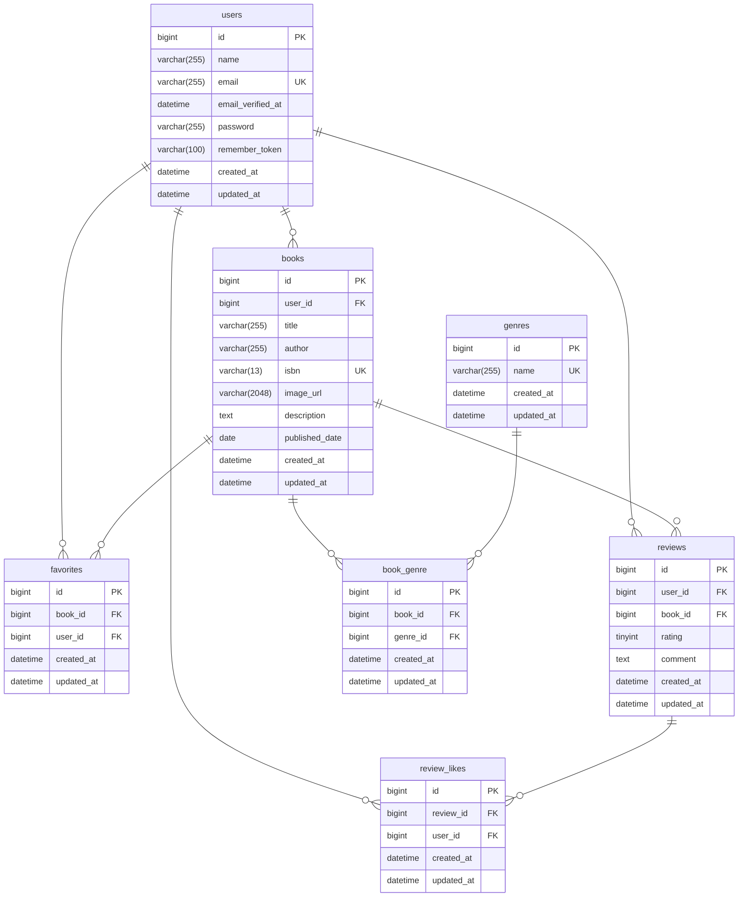

## ER図

```mermaid
erDiagram

users ||--o{ books : ""
users ||--o{ favorites : ""
books ||--o{ favorites : ""
users ||--o{ reviews : ""
users ||--o{ review_likes : ""
reviews ||--o{ review_likes : ""
books ||--o{ reviews : ""
books ||--o{ book_genre : ""
genres ||--o{ book_genre : ""

users{
    bigint id PK
    varchar(255) name
    varchar(255) email UK
    datetime email_verified_at
    varchar(255) password
    varchar(100) remember_token
    datetime created_at
    datetime updated_at
}

books{
    bigint id PK
    bigint user_id FK
    varchar(255) title
    varchar(255) author
    varchar(13) isbn UK
    varchar(2048) image_url
    text description
    date published_date
    datetime created_at
    datetime updated_at
}

genres{
    bigint id PK
    varchar(255) name UK
    datetime created_at
    datetime updated_at
}

reviews{
    bigint id PK
    bigint user_id FK
    bigint book_id FK
    tinyint rating
    text comment
    datetime created_at
    datetime updated_at
}

book_genre{
    bigint id PK
    bigint book_id FK
    bigint genre_id FK
    datetime created_at
    datetime updated_at
}

review_likes{
    bigint id PK
    bigint review_id FK
    bigint user_id FK
    datetime created_at
    datetime updated_at
}

favorites{
    bigint id PK
    bigint book_id FK
    bigint user_id FK
    datetime created_at
    datetime updated_at
}

```